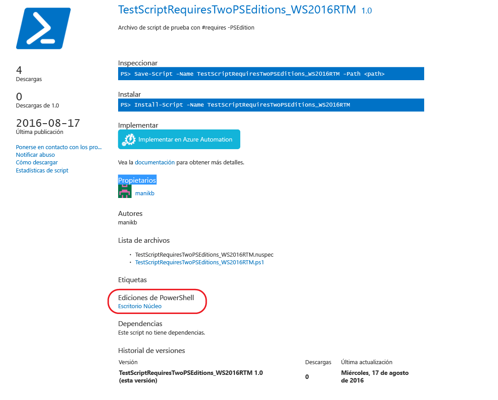

# Elementos con las ediciones compatibles de PowerShell

A partir de la versión 5.1, PowerShell está disponible en diferentes ediciones que denotan distintos conjuntos de características y compatibilidad con varias plataformas.

- **Desktop Edition:** basado en .NET Framework y proporciona compatibilidad con scripts y módulos destinados a las versiones de PowerShell que se ejecutan en las ediciones de superficie completa de Windows como Server Core y Windows Desktop.
- **Core Edition:** basado en .NET Core y proporciona compatibilidad con scripts y módulos destinados a las versiones de PowerShell que se ejecutan en las ediciones de superficie completa de Windows como Nano Server y Windows IoT.

## La Galería de PowerShell extrae metadatos de PSEditions compatibles y permite filtrar los elementos compatibles con ediciones específicas de PowerShell

Si en un elemento se han especificado PSEditions compatibles, se enumerarán como parte de "Ediciones de PowerShell" en la página de visualización del elemento y en los resultados de los elementos.

## Buscar elementos en la interfaz de usuario de la Galería que funciona en PowerShellCore

Use Tags:"PSEdition_Desktop" y Tags:"PSEdition_Core" para filtrar los elementos de la Galería de PowerShell.

### Use Tags:"PSEdition_Core" para buscar elementos compatibles con la edición PowerShell Core.

### Use Tags:"PSEdition_Desktop" para buscar elementos compatibles con la edición PowerShell Desktop.

## Obtener más detalles sobre la creación y la búsqueda de elementos con ediciones compatibles de PowerShell

- [Módulos con PSEditions](../../concepts/module-psedition-support.md)
- [Scripts con PSEditions](../../concepts/script-psedition-support.md)